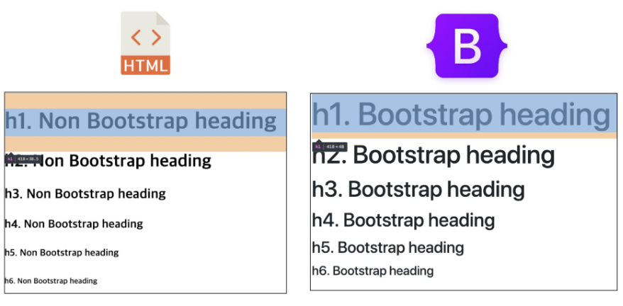
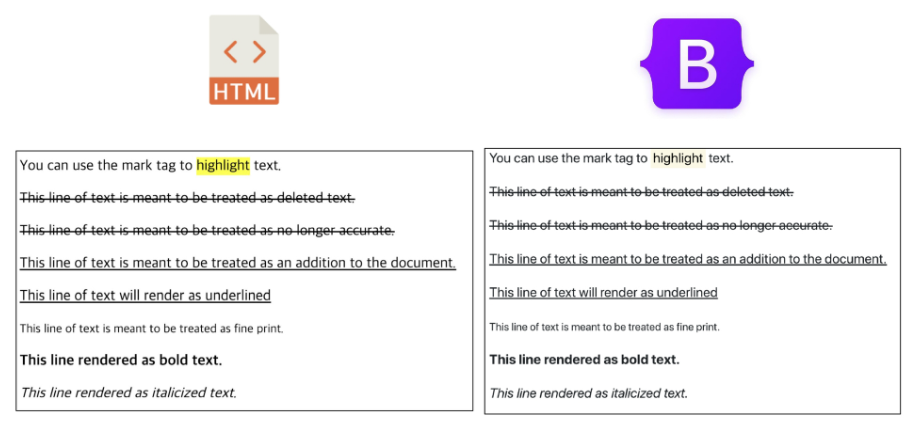

## Bootstrap

Build fast, responsive sites with Bootstrap. 

**`Quickly`** design and customize **`responsive`** mobile-first sites with Bootstrap, **`the world’s most popular`** front-end open source toolkit, featuring Sass variables and mixins, **`responsive grid system`**, extensive **`prebuilt components`**, and powerful JavaScript plugins.

https://getbootstrap.com/docs/5.0/getting-started/doownload/

- 트위터에서 시작된 오픈 소스 프론트엔드 라이브러리
- 웹 페이지에 많이 쓰이는 요소 거의 전부를 내장하고 있다.
- 별도의 디자인을 할 시간이 크게 줄어들고, 여러 웹 브러우저를 지원하기 위한 크로스 브라우징에 불필요한 시간을 사용하지 않도록 도와준다.
- one source multi use
  - 반응형 웹 디자인






> **CDN**

- Content Delivery(Distribution) Network
- 컨텐츠(CSS, JS, Image, Text 등)를 효율적으로 전달하기 위해, 서버와 사용자 사이의 물리적 거리를 줄여 컨텐츠 로드 지연을 최소화
- 분산 된 서버로 이루어진 플랫폼
  - 전 세계 사용자들이 로딩 시간을 늦추지 않고 동일한 품질의 컨텐츠를 사용할 수 있다.
- 장점
  - 사용자와 가까운 서버를 통해 빠르게 전달 가능
  - `외부서버`를 활용함으로써 본인 서버의 부하가 적어진다.


> **spacing**

bootstrap.css에 구현되어 있는 클래스

**`.mt-1`**

```css
.mt-1 {
    margin-top: 0.25rem !important;
}
```

- 16 * 0.25 = 4px

| class name | rem  |  px  |
| :--------: | :--: | :--: |
|    m-1     | 0.25 |  4   |
|    m-2     | 0.5  |  8   |
|    m-3     |  1   |  16  |
|    m-4     | 1.5  |  24  |
|    m-5     |  3   |  48  |


**`.mx-0`**

```css
.mx-0 {
    margin-right: 0 !important;
    margin-left: 0 !important;
}
```


**`.mx-auto`**

```css
.mx-auto {
    margin-right: auto !important;
    margin-left: auto !important;
}
```


**`.py-0`**

```css
.py-0 {
    padding-top: 0 !important;
    padding-bottom: 0 !important;
}
```


> **spacing 종합**

- **`m`**, margin
- **`p`**, padding
  - **`t`**, top
  - **`b`**, bottom
  - **`s`**, left
  - **`e`**, right
  - **`x`**, left/right
  - **`y`**, top, bottom

| rem  |  px  |
| :--: | :--: |
| 0.25 |  4   |
| 0.5  |  8   |
|  1   |  16  |
| 1.5  |  24  |
|  3   |  48  |


> **color**

```css
:root {
  --bs-blue: #0d6efd;
  --bs-indigo: #6610f2;
  --bs-purple: #6f42c1;
  --bs-pink: #d63384;
  --bs-red: #dc3545;
  --bs-orange: #fd7e14;
  --bs-yellow: #ffc107;
  --bs-green: #198754;
  --bs-teal: #20c997;
  --bs-cyan: #0dcaf0;
  --bs-white: #fff;
  --bs-gray: #6c757d;
  --bs-gray-dark: #343a40;
  --bs-primary: #0d6efd;
  --bs-secondary: #6c757d;
  --bs-success: #198754;
  --bs-info: #0dcaf0;
  --bs-warning: #ffc107;
  --bs-danger: #dc3545;
  --bs-light: #f8f9fa;
  --bs-dark: #212529;
}
```


> **실습**

```html
<h2>Spacing</h2>
<div class="box mt-3 ms-5">margin-top 3</div>
<div class="box m-4">margin 4</div>
<div class="box mx-auto">mx-auto, 가운데 정렬</div>
<div class="box ms-auto">ms-auto, 오른쪽 정렬</div>
```


```html
<h2>Color</h2>
<div class="bg-primary">이건 파랑</div>
<div class="bg-secondary">이건 회색</div>
<div class="bg-danger">이건 빨강</div>
<div class="text-success">이건 초록색 글씨</div>
<div class="text-danger">이건 빨간색 글씨</div>
```


```html
<h2>Text</h2>
<p class="text-start">Start aligned text on all viewport sizes.</p>
<p class="text-center">Center aligned text on all viewport sizes.</p>
<p class="text-end">End aligned text on all viewport sizes.</p>
<a href="#" class="text-decoration-none">Non-underlined link</a>
<p class="fw-bold">Bold text.</p>
<p class="fw-normal">Normal weight text.</p>
<p class="fw-light">Light weight text.</p>
<p class="fw-italic">Italic text.</p>
```


```html
<h2>Display</h2>
<div class="d-inline p-2 bg-primary text-white">d-inline</div>
<div class="d-inline p-2 bg-dark text-white">d-inline</div>
<span class="d-block p-2 bg-primary text-white">d-block</div>
<span class="d-block p-2 bg-dark text-white">d-block</div>
<div class="box bg-warning d-sm-none d-md-block">can you see me?</div>
<div class="box bg-success d-md-none d-xl-block">can you see me?</div>
```


```html
<h2>Position</h2>
<div class="box fixed-top">fixed-top</div>
<div class="box fixed-bottom">fixed-bottom</div>
```


> **Responsive Web Design**

- 다양한 화면 크기를 가진 디바이스들이 등장함에 따라 reponsive web design 개념이 등장

- 반응형 웹은 별도의 기술 이름이 아닌 웹 디자인에 대한 접근 방식, 

  반응형 레이아웃 작성에 도움이 되는 사례들의 모음 등을 기술하는데 사용되는 언어

- 예시

  - Media Queries, **`Flexbox`, `Bootstrap Grid System`**, The viewport meta tag


> **Grid System**

Use our powerful mobile-first **`flexbox grid`** to build layouts of all shapes and sizes thanks to a **`12 column system`, `6 default reponsive tiers`**, Sass variables and mixins, and dozens of predefined classes.

- Bootstrap Grid System은 flexbox로 제작되었다.
- **`container`, `rows`, `column`**으로 컨텐츠를 배치하고 정렬
- 반드시 기억할 2가지!!!
  - **`12개의 column`**
    - 약수가 충분히 많기 때문에 12로 설정, 다양한 배율로 설정할 수 있다.
  - **`6개의 grid breakpoints`**


> **Grid System class**

- **row**
  - columns의 wrapper
- **gutters**
  - gird시스템에서 반응적으로 공간을 확보하고 컨텐츠를 정렬하는데 사용되는 column 사이의 padding

- **col, col-***
  - column class는 row당 가능한 12개 중 사용하려는 column 수를 나타낸다.
  - columns 너비는 백분율로 설정 되므로 항상 부모 요소를 기준으로 유동적으로 크기가 조정된다.
  - grid layout에서 내용은 반드시 columns안에 있어야하며, 오직 columns만 row의 바로 하위 자식일 수 있다.
- **offset**
  - 지정한 만큼의 column 공간을 무시하고 다음 공간부터 컨텐츠를 적용
- **nesting**
  - row > col-* > row > col-*의 방식으로 중첩 사용 가능


> **Grid breakpoints**

- 다양한 디바이스에서 적용하기 위해 특정 px(픽셀) 조건에 대한 지점을 정해 두었는데 이를 breakpoints라고 한다.
- Bootstrap은 대부분의 크기를 정의하기 위해 em 또는 rem을 사용하지만 px은 grid breakpoints에 사용
  - viewport너비가 픽셀 단위이고 글꼴 크기에 따라 변하지 않기 때문
- 폭을 반드시 다 사용해야하는 것은 아니다. 선택 가능한 지점이 6군데
  - **xs** <576px 
  - **sm** ≥576px
  - **md** ≥768px
  - **lg** ≥992px 
  - **xl** ≥1200px 
  - **xxl** ≥1400px