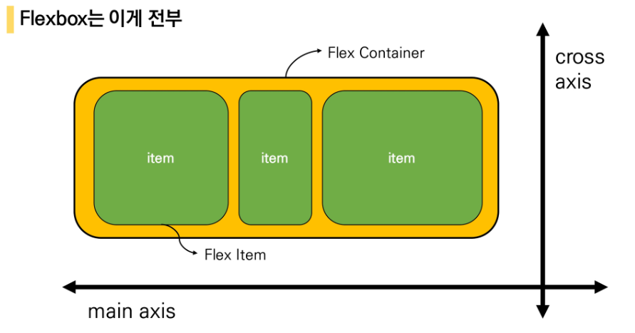
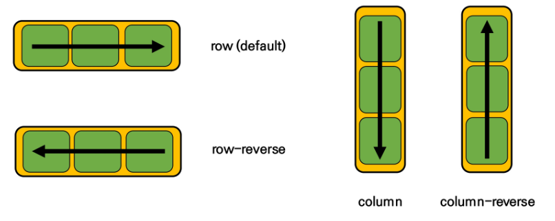
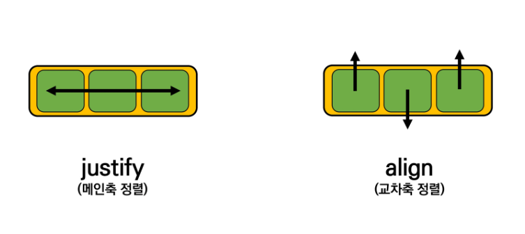

## Flexbox

> **CSS Flexible Box Layout**

- 요소간 공간 배분과 정렬 기능을 위한 1차원(단방향) 레이아웃
- 크게 딱 2가지만 기억할 것!  **`요소!`**와 **`축!`** 
- 요소
  - Flex Container (부모 요소)
  - Flex Item (자식 요소)
- 축
  - main axis (메인축)
  - cross axis (교차축)




> **Flexbox의 구성요소**

- Flex Container (부모 요소)
  - flexbox 레이아웃을 형성하는 가장 기본적인 모델
  - Flex Item들이 놓여있는 영역
  - display 속성을 flex 혹은 inline-flex로 지정
- Flex Item (자식 요소)
  - 컨테이너의 컨텐츠


> **flexbox의 시작**

- 부모 요소에 display: flex 혹은 inline-flex를 작성하는 것부터 시작

```css
.flex-container {
    displat: flex;
}
```


> **Flex에 적용하는 속성**

- 배치 방향 설정
  - flex-direction
- 메인축 방향 정렬
  - justify-content
- 교차축 방향 정렬
  - align-items, align-self, align-content
- 기타
  - flex-wrap, flex-flow, flex-grow, order, flex-shrink, flex-basis


> **flex-direction**

- main-axis 방향만 바뀐다.
- flexbox는 단방향 레이아웃이기 때문이다.




> **justify & align**




> **content & items & self**

- content
  - 여러 줄

- items
  - 한 줄
- self
  - flex item 개별 요소
- 예시
  - justify-content : 메인축 기중 여러 줄 정렬
  - align-items : 교차축 기준 한 줄 정렬
  - align-self : 교차축 기준 선택한 요소 하나 정렬


- justify-content
  - flex-start, flex-end, center, space-between, space-around, space-evenly
- align-items
  - flex-start, flex-end, center, stretch, baseline
- align-content
  - flex-start, flex-end, center, stretch, space-between, space-around
- align-self
  - auto, flex-start, flex-end, center, baseline, stretch


> **Flexbox 정리**

- **`display: flex`**
  - 정렬하려는 부모 요소에 작성
  - inline-flex : flex 영역을 블록으로 쓰지 않고 인라인 블록으로 사용
- **`flex-direction`**
  - item이 쌓이는 방향 결정
  - main-axis 가 변경된다.
  - row(기본값) : 주축의 방향이 왼쪽에서 오른쪽
  - row-reverse : 주축의 방향이 오른쪽에서 왼쪽
  - column : 주축의 방향이 위에서 아래
  - column-reverse : 주축의 방향이 아래에서 위
- **`flex-wrap`**
  - 요소들이 강제로 한 줄에 배치 되게 할 것인지 여부 설정
  - nowrap(기본값) : 모든 아이템들 한 줄에 나태내려고 한다. -> 그래서 자리가 없어도 튀어나온다. 
  - wrap : 넘치면 그 다음줄로
  - wrap-reverse : 넘치면 그 윗줄로(역순)
- **`flex-flow`**
  - flex-direction과 flex-wrap의 shorthand
  - flex-direction과 flex-wrap에 대한 설정 값을 차례로 작성
  - 예시) flex-flow: row nowrap;


- **`align-items`**
  - cross : 축 정렬
  - stretch (기본값) : 컨테이너를 가득 채운다.
  - flex-start : 위
  - flex-end : 아래
  - center: 가운데
  - baseline : item 내부의 text에 기준선을 맞춘다.

- **`align-self`**
  - 개별 item에 적용하는 속성(정렬 방식은 align-items와 동일, 속성이 적용되는 대상이 다르다.)
  - auto (기본값)
  - flex-start 
  - flex-end
  - center
  - baseline
  - stretch : 부모 컨테이너에 자동으로 맞춰서 늘어난다.


- **`order`**
  - 작은 숫자일수록 앞(우선 쌓이는 방향)으로 이동
  - 기본 값 : 0


- **`flex-grow`**
  - 주축에서 남는 공간을 항목들에게 분배하는 방법
  - 각 아이템의 상대적 비율을 정하는 것이 아니다.
  - 기본 값 :0
  - 음수 불가능