# APS(Algorithm Problem Solving) 기본


## 알고리즘 

- 유한한 단계를 통해 문제를 해결하기 위한 절차나 방법이다. 주로 컴퓨터용어로 쓰이며, 컴퓨터가 어떤 일을 수행하기 위한 단계적 방법을 말한다.

- 간단하게 어떠한 문제를 해결하기 위한 절차라고 볼 수 있다.
- APS 과정의 목표 중 하나는 보다 좋은 알고리즘을 이해하고 활용하는 것이다.

> **무엇이 좋은 알고리즘인가?**

1.  **`정확성`** : 얼마나 정확하게 동작하는가
2. **`작업량`** : 얼마나 적은 연산으로 원하는 결과를 얻어내는가
3. **`메모리 사용량`** : 얼마나 적은 메모리를 사용하는가
4. **`단순성`** : 얼마나 단순한가
5. **`최적성`** : 더 이상 개선할 여지 없이 최적화되었는가

- 많은 문제에서 성능 분석의 기준으로 알고리즘의 작업량을 비교한다.
- 알고리즘의 작업량을 표현할 때 **`시간복잡도`**로 표현한다.


## 슈더코드(Pseudocode)와 순서도

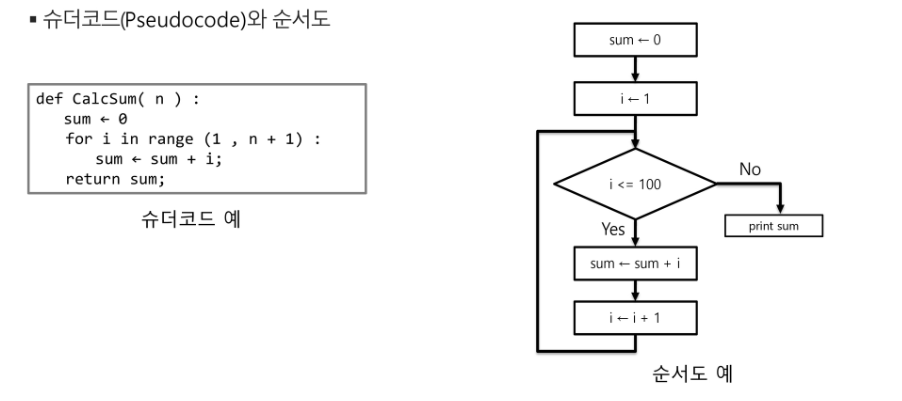


## 시간복잡도(Time Complexity)

- 실제 걸리는 시간을 측정
- 실행되는 명령문의 개수를 계산
- **`빅-오(O) 표기법`**
  - 시간 복잡도 함수 중에서 가장 큰 영향력을 주는 n에 대한 항만을 표시
  - 계수(coefficient)는 생략하여 표시
  - 예를 들어 O(3n + 2) = O(3n) = O(n)
  - O(2n² + 10n + 100) = O(n²)

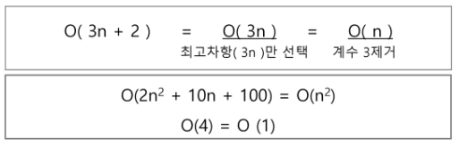

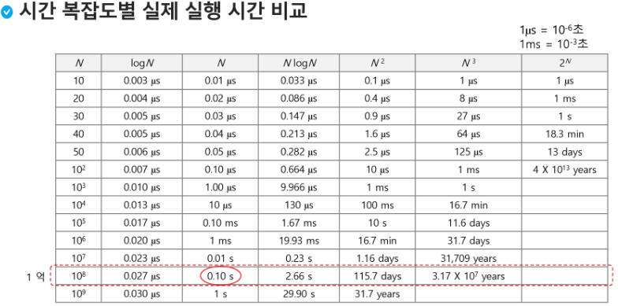


## 배열

### 배열이란 무엇인가

- 일정한 자료형의 변수들을 하나의 이름으로 열거하여 사용하는 자료구조

### 배열의 필요성

- 프로그램 내에서 여러개의 변수가 필요할 때, 일일이 다른 변수명을 이용하여 자료에 접근하는 것은 매우 비효율적일 수 있다.
- 배열을 사용하면 하나의 선언을 통해서 둘 이상의 변수를 선언할 수 있다.
- 단순히 다수의 변수 선언을 의미하는 것이 아니라, **`다수의 변수로는 하기 힘든 작업을 배열을 활용해 쉽게 항 수 있다.`**

### 배열 활용 예제(Gravity)

### 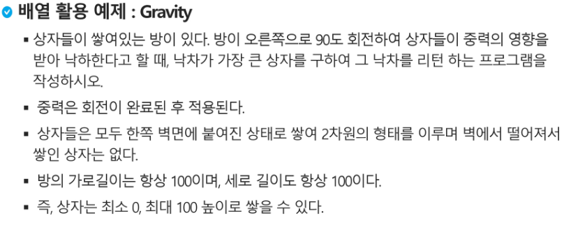

- 자기 다음의(오른쪽) 숫자와의 차이를 잘생각해서 문제를 풀어볼 수 있다.


### 대표적인 정렬 방식의 종류

- 버블 정렬(Bubble Sort)
- 카운팅 정렬(Counting Sort)
- 선택 정렬(Selection Sort)
- 퀵 정렬(Quick Sort)
- 삽입 정렬(Insertion Sort)
- 병합 정렬(Merge Sort)


## 버블 정렬(Bubble Sort)

- 인접한 두 개의 원소를 비교하며 자리를 계속 교환하는 방식
- 정렬과정
  - 첫 번째 원소부터 인접한 원소끼리 계속 자리를 교환하면서 맨 마지막 자리까지 이동한다.
  - 한 단계가 끝나면 가장 큰 원소가 마지막 자리로 정렬된다.
  - 교환하며 자리를 이동하는 모습이 물 위에 올라오는 거품 모양과 같다고 하여 버블 정렬이라고 한다.
- 시간복잡도
  - O(n²)

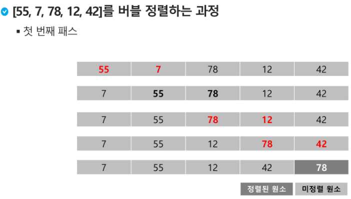

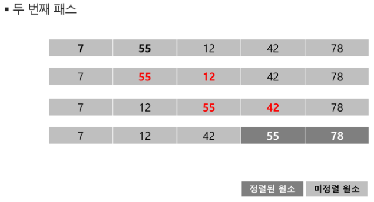

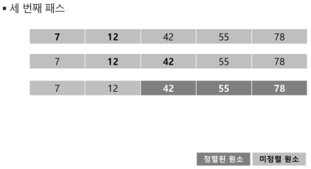


```python
def BubbleSort(a):
    for i in range(len(a)-1, 0 ,-1):
        for j in range(0, i):
            if a[j] > a[j+1]:
                a[j], a[j+1] = a[j+1], a[j]
```


## 카운팅 정렬(Counting Sort)

- 카운팅 정렬은 **`안정정렬(stable sort)`**
  - 중복값에 대해 원래의 정렬을 유지시켜주는 것을 안정정렬이라고 한다.

- 항목들의 순서를 결정하기 위해 집합에 각 항목이 몇 개씩 있는지 세는 작업을 하여, 선형 시간에 정렬하는 효율적인 알고리즘
- 제한 사항
  - 정수나 정수로 표현할 수 있는 자료에 대해서만 적용 가능 : 각 항목의 발생회수를 기록하기 위해, 정수 항목으로 인덱스 되는 카운트들의 배열을 사용하기 때문이다.
- 시간 복잡도
  - O(n + k) : n은 리스트 길이, k는 정수의 최대값


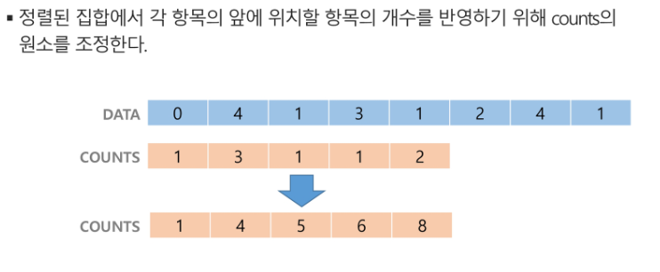

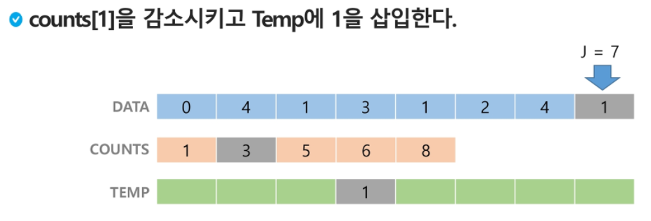

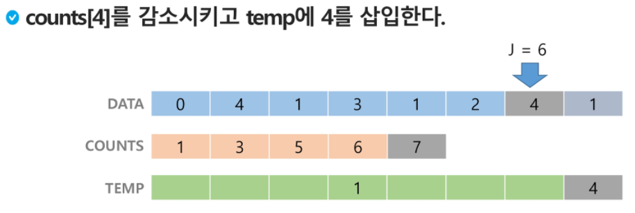

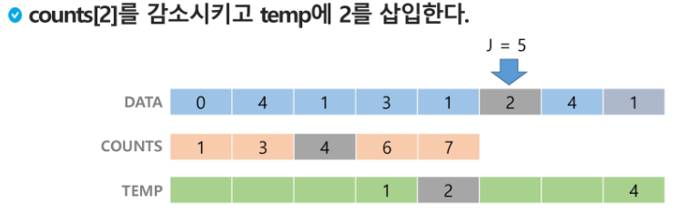

``` python
def CountingSort(A, B, k)
# A [] -- 입력 배열(1~k)
# B [] -- 정렬된 배열
# C [] -- 카운트 배열
# index는 0부터 시작하기 때문에 k+1
C = [0] * (k+1)
for i in range(0, len(A)):
    C[A[i]] += 1
for i in range(1, len(C)):
    C[i] += C[i-1]
for i in range(len(B)-1, -1, -1):
    B[C[A[i]]-1] = A[i]
    C[A[i]] -= 1
    # C[A[i]] -= 1
    # B[C[a[i]]] = A[i]
```


> **`버블정렬`**은 **비교와 교환** 알고리즘 기법을 활용, 코딩이 가장 손쉽다.
>
> **`카운팅정렬`**은 **비교환 방식**의 알고리즘 기법을 활용,  n이 비교적 작을 때만 가능하다.


## Baby-gin Game

- 설명
  - 0~9 사이의 숫자 카드에서 임의의 카드 6장을 뽑았을 때, 3장의 카드가 연속적인 번호를 갖는 경우를 run이라 하고, 3장의 카드가 동일한 번호를 갖는 경우를 triplet이라고 한다.
  - 그리고, 6장의 카드가 run과 triplet으로만 구성된 경우를 baby-gin으로 부른다.
  - 6자리의 숫자를 입력 받아 baby-gin 여부를 판단하는 프로그램을 작성하라.
- **완전검색(Exhaustive Search)**
  - 완전 검색 방법은 문제의 해법으로 생각할 수 있는 모든 경우의 수를 나열해보고 확인하는 기법이다.
  - Brute-force 혹은 Generate-and-test 기법이라고도 불린다.
  - 모든 경우의 수를 테스트한 후, 최종 해법을 도출한다.
  - 일반적으로 경우의 수가 상대적으로 작을 때 유용하다.

### 순열

nPr = n * (n-1) * (n-2) * ... * (n-r+1)

```python
for i1 in range(1, 4):
    for i2 in range(1, 4):
        if i2 != i1:
            for i3 in range(1, 4):
                for i3 != i! anf i3 != i2:
                    print(i1, i2, i3)
```


## 탐욕(Greedy) 알고리즘

- 탐욕 알고리즘은 최적해를 구하는 데 사용되는 근시안적인 방법
- 여러 경우 중 하나를 결정해야 할 때마다 그 순간에 최적이라고 생각되는 것을 선택해 나가는 방식으로 진행하여 최종적인 해답에 도달한다.
- 각 선택의 시점에서 이루어지는 결정은 지역적으로는 최적이지만, 그 선택들을 계속 수집하여 최종적인 해답을 만들었다고 하여, 그것이 최적이라는 보장은 없다.
- 일반적으로, 머릿속에 떠오르는 생각을 검증 없이 바로 구현하면 Greedy 접근이 된다.
- 동작 과정
  - 1. 해 선택 : 현재 상태에서 부분 문제의 최적 해를 구한 뒤, 이를 부분해집합(Solution Set)에 추가한다.
    2. 실행 가능성 검사 : 새로운 부분해 집합이 실행 가능한지를 확인한다. 곧, 문제의 제약 조건을 위반하지 않는지를 검사한다.
    3. 해 검사 : 새로운 부분해 집합이 문제의 해가 되는지를 확인한다. 아직 전체 문제의 해가 완성되지 않았다면 해 선택부터 다시 시작한다.