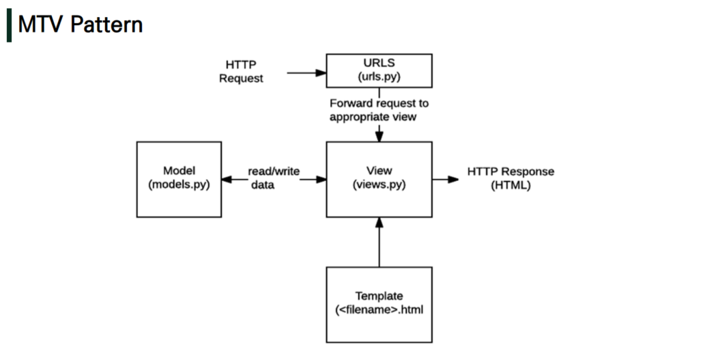

# Django

## Django The Web Framework

**Django** is a high-level **`Python web framework`** that encourages rapid development and clean, pragmatic design. 

Built by experienced developers, it takes care of much of the hassle of web development, so **you can focus on writing your app without needing to reinvent the wheel.**

## Web

- World Wide Web
- 인터넷에 연결된 컴퓨터를 통해 정보를 공유할 수 있는 전 세계적인 정보 공간

## Static Web Page (정적 웹 페이지)

- 서버에 미리 저장된 파일이 사용자에게 그대로 전달되는 웹 페이지
- 서버가 정적 웹 페이지에 대한 요청을 받은 경우, 서버는 추가적인 처리 과정 없이 클라이언트에게 응답을 보낸다.
- 모든 상황에서 모든 사용자에게 동일한 정보를 표시한다.
- 일반적으로 HTML, CSS, JavaScript로 작성된다.
- flat page라고도 한다.

## Dynamic Web Page (동적 웹 페이지)

- 웹 페이지에 대한 요청을 받은 경우 서버는 추가적인 처리 과정 이후 클라이언트에게 응답을 보낸다.
- 동적 페이지는 방문자와 상호작용하기 때문에 페이지 내용은 그때 그때 다르다.
- 서버 사이드 프로그래밍 언어(python, java, c++ 등)가 사용되며, 파일을 처리하고 데이터베이스와의 상호작용이 이루어진다.

## Framework

- 프로그래밍에서 특정 운영 체제를 위한 응용 프로그램 표준 구조를 구현하는 클래스와 라이브러리 모임
- 재사용할 수 있는 수 많은 코드를 프레임워크로 통합함으로써, 개발자가 새로운 어플리케이션을 위한 표준 코드를 다시 작성하지 않아도 같이 사용할 수 있도록 도와준다.
- Application Framework라고도 한다.

## Web Framework

- **웹 페이지를 개발하는 과정에서 겪는 어려움을 줄이는 것이 주 목적**으로 데이터베이스 연동, 템플릿 형태의 표준, 세션 관리, 코드 재사용 등의 기능을 폼함
- 동적인 웹 페이지, 웹 어플리케이션, 웹 서비스 개발 보조용으로 만들어지는 Application Framework의 일종

## Framework Architecture

- MVC Design Pattern (Model-View-Controller)
- 소프트웨어 공학에서 사용되는 디자인 패턴 중 하나
- 사용자 인터페이스로부터 프로그램 로직을 분리하여 어플리케이션의 시각적 요소나 이면에서 실행되는 부분을 서로 영향 없이 쉽게 고칠 수 있는 어플리케이션을 만들 수 있다.
- Django는 MTV Pattern이라고 한다.

## MTV Pattern (Model-Template-View)

- Model
  - 응용프로그램의 데이터 구조를 정의하고 데이터베이스의 기록 관리(추가 / 수정 / 삭제)
- Template
  - 파일의 구조나 레이아웃을 정의
  - 실제 내용을 보여주는데 사용(presentation)
- View
  - HTTP 요청을 수신하고 HTTP 응답을 반환
  - Model을 통해 요청을 충족시키는데 필요한 데이터에 접근
  - Template에게 응답의 서식 설정을 맡긴다.

\* django 참고 : https://docs.djangoproject.com/en/3.2/

