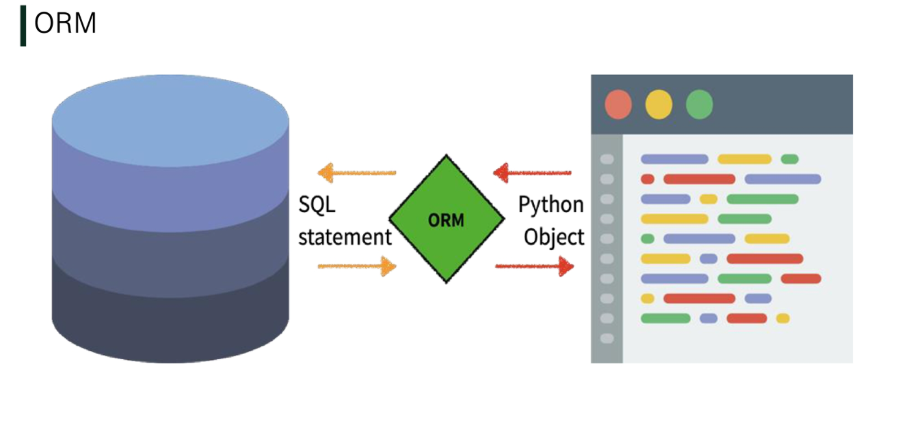

# Model

- 단일한 데이터에 대한 정보를 가진다.
  - 사용자가 저장하는 데이터들의 필수적인 필드들과 동작들을 포함한다.
- 저장된 데이터베이스의 구조 (layout)
- django는 model을 통해 데이터에 접속하고 관리
- 일반적으로 각각의 model은 하나의 데이터베이스 테이블에 매핑 된다
- 그러나, 모델과 데이터베이스가 같은 것은 아니다!!


- 웹 어플리케이션의 데이터를 구조화하고 조작하기 위한 도구

# Database

- **`데이터베이스(DB)`**
  - 체계화된 데이터의 모임
- **`쿼리(Query)`**
  - 데이터를 조회하기 위한 명령어
  - 조건에 맞는 데이터를 추출하거나 조작하는 명령어


## Database의 기본 구조

- **`스키마(Schema)`**
  - 데이터베이스에서 자료의 구조, 표현 방법, 관계 등을 정의한 구조
- **`테이블(Table)`**
  - 열과 행의 모델을 사용해 조작되니 데이터 요소들의 집합.
  - 열(column) : 필드(field) or 속성, 각 열에는 고유한 데이터 형식이 지정된다.
  - 행(row) : 레코드(record) or 튜플, 테이블의 데이터는 행에 저장된다.
- **`기본키(PK)`**
  - 각 행(레코드)의 고유값으로  **Primary Key**로 불린다. 
  - 반드시 설정해야하며, 데이터베이스 관리 및 관계 설정시 주요하게 활용된다.

# ORM

- Object-Relational-Mapping
- 객체 지향 프로그래밍 언어를 사용하여 호환되지 않는 유형의 시스템 간에(django-sql) 데이터를 변환하는 프로그래밍 기술
- OOP 프로그래밍에서 RDBMS를 연동할 때, 데이터베이스와 객체 지향 프로그래밍 언어 간의 호환되지 않는 데이터를 변환하는 프로그래밍 기법
- django는 내장 django ORM을 사용
- 


## ORM의 장점과 단점

- 장점
  - SQL을 몰라도 DB 조작이 가능하다.
  - SQL의 절차적 접근이 아닌 객체 지향적 접근으로 인한 **높은 생산성**
- 단점
  - ORM만으로 완전한 서비스를 구현하기 어려운 경우가 있다.

=> 현대 웹 프레임워크 요점은 웹 개발의 속도를 높이는 것이다. (-> **생산성**)

"우리는 DB를 객체(object)로 조작하기 위해 ORM을 사용한다."

# Django Model

## 사용 모델 필드

### CharField ( max_length=None, **options )

- 길이의 제한이 있는 문자열을 넣을 때 사용
- max_length는 필수인자
- 필드의 최대 길이(문자), 데이터베이스 레벨과 Django의 유효성 검사(값을 검증하는 것)에서 활용


### TextField ( **options )

- 글자수가 많을 때 사용
- max_length 옵션 작성시 자동 양식 필드인 textarea 위젯에 반영은 되지만 모델과 데이터베이스 수준에는 적용되지 않는다. (-> CharField 사용)

# Migrations

- django가  model에 생긴 변화를 DB에 반영하는 방법
- Migration 실행 및 DB 스키마를 다루기 위한 몇가지 명령어
  - **makemigrations**
  - **migrate**
  - sqlmigrate
  - showmigrations


## migration 3단계

1. models.py
   - model 변경사항 발생 시
2. $ python manage.py makemigrations
   - migations 파일 생성 (설계도 생성)
3. $ python manage.py migrate
   - DB 적용


### 1. makemigrations

- model을 변경한 것에 기반한, 새로운 마이그레션(설계도)을 만들 때 사용

```bash
python manage.py makemigrations
```


### 2. migrate

- 마이그레이션을 DB에 반영하기 위해 사용
- 설계도를 실제 DB에 반영하는 과정
- 모델에서의 변경 사항들과 DB의 스키마가 동기화를 이룬다.

```bash
python manage.py migrate
```


### 3. sqlmigrate

- 마이그레이션에 대한 SQL 구문을 보기 위해 사용
- 마이그레이션이 SQL문으로 어떻게 해석되어 동작할지 미리 확인할 수 있다.

```bash
python manage.py sqlmigrate articles 0001
```


### 4. showmigrations

- 프로젝트 전체의 마이그레이션 상태를 확인하기 위해 사용
- 마이그레이션 파일들이 migrate 됐는지 안됐는지 여부를 확인할 수 있다.

```bash
python manage.py showmigrations
```


## DataTimeField's options

### auto_now_add

- 최초 생성 일자
- django ORM이 최초 insert(테이블에 데이터 입력)시에만 현재 날짜와 시간으로 갱신 (테이블에 어떤 값을 최초로 넣을 때)

### auto_now

- 최종 수정 일자
- django ORM이 save를 할 때마다 현재 날짜와 시간으로 갱신


# Database API

- DB를 조작하기 위한 도구
- django가 기본적으로 ORM을 제공함에 따른 것으로 DB를 편하게 조작할 수 있도록 도움을 준다.
- Model을 만들면 django는 객체들을 만들고 읽고 수정하고 지울 수 있는 database-abstract API를 자동으로 만든다.
- database-abstract API 혹은 database-access API 라고 한다.


```python
# className.Manager.QuerySet API
Article.objects.all()
```

### Manager

- django 모델에 데이터베이스 query 작업이 제공되는 인터페이스
- 기본적으로 모든 django 모델 클래스에 objects라는 Manager를 추가
- QuerySet API를 쓰기 위해 사용되는 Manager

### QuerySet

- 데이터베이스로부터 전달받은 객체 목록
- queryset 안의 객체는 0개, 1개 혹은 여러 개일 수 있다.
- 데이터베이스로부터 조회, 필터, 정렬 등을 수행할 수 있다.


## Django shell

- 일반 파이썬 쉘을 통해서는 장고 프로젝트 환경에 접근할 수 없다.
- 장고 프로젝트 설정이 로드 된 파이썬 쉘(+shell_plus)을 활용해 DB API 구문 테스트를 수행할 수 있다.
- 기본 Django shell보다 더 많은 기능을 제공하는 shell_plus, 설치 후 진행

```bash
$ pip install ipython
$ pip install django-extensions
```

```python
# setting.py
INSTALLED_APPS = [
    'django_extensions',
]
```

```bash
$ python manage.py shell_plus
```

